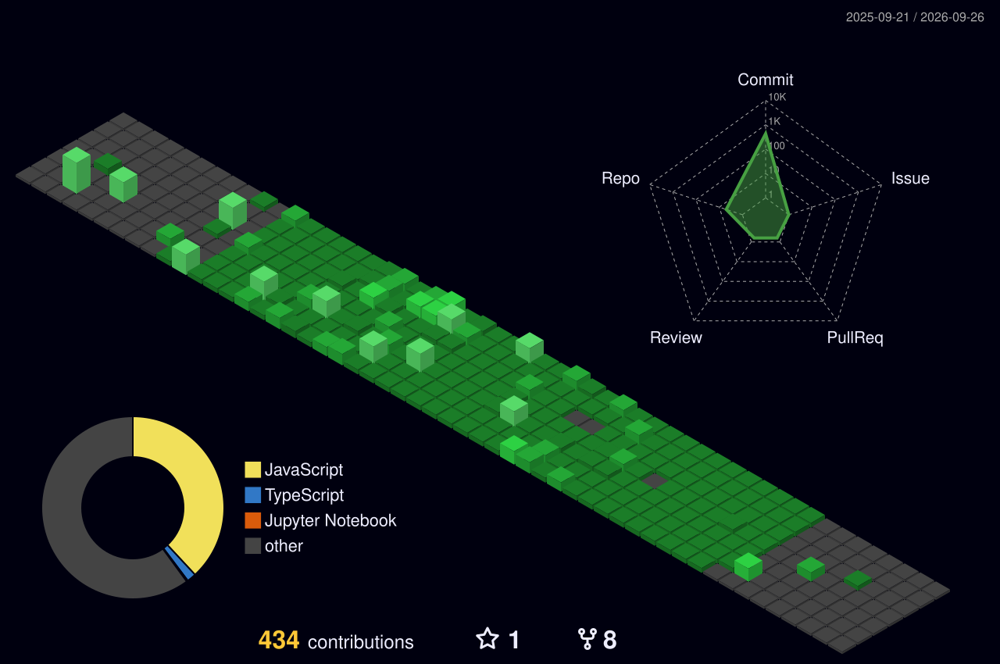

# Vighnesh Brahme [ 🦅ThePhoenix08 ]

I'm a Computer Engineering graduate (Batch of 2026) who enjoys building software that blends problem-solving, system design, and creativity. I'm particularly interested in backend engineering, efficient algorithms, and full-stack applications that solve real-world problems.

### What I'm Currently Up To
- Practicing Data Structures & Algorithms and sharpening my problem-solving skills on LeetCode
- Exploring backend engineering with Java, Spring Boot, REST APIs, and database design
- Building full-stack applications and learning how to design reliable, maintainable software systems
- Experimenting with Machine Learning and exploring ways to integrate AI into practical applications
- Working on projects that bring together software engineering, performance, and AI-driven ideas

### I have experience in

  <a href="https://skillicons.dev">
    
    &nbsp;
    
    &nbsp;
    
    &nbsp;
    
    &nbsp;
    
  </a>

### Get in touch
<table align="center">
  <tr>
    <td align="center">
      
    </td>
    <td align="center">
      
    </td>
    <td align="center">
      
    </td>
    <td align="center">
      
    </td>
    <td align="center">
      
    </td>
    <td align="center">
      
    </td>
  </tr>
  <tr>
    <td align="center"><b>Gmail</b></td>
    <td align="center"><b>LinkedIn</b></td>
    <td align="center"><b>HackerRank</b></td>
    <td align="center"><b>LeetCode</b></td>
    <td align="center"><b>Portfolio</b></td>
    <td align="center"><b>Resume</b></td>
  </tr>
</table>

### Let's Collaborate!
🚀 Always interested in building meaningful projects, exploring new technologies, and collaborating with developers who enjoy solving challenging problems.

Thanks for stopping by! 😊

---
### My Contributions
<!--  -->
<picture>
  <source media="(prefers-color-scheme: dark)" srcset="https://raw.githubusercontent.com/ThePhoenix08/ThePhoenix08/output/pacman-contribution-graph-dark.svg">
  <source media="(prefers-color-scheme: light)" srcset="https://raw.githubusercontent.com/ThePhoenix08/ThePhoenix08/output/pacman-contribution-graph.svg">
  
<picture/>

<!--Snake
<picture>
  <source media="(prefers-color-scheme: dark)" srcset="https://raw.githubusercontent.com/ThePhoenix08/ThePhoenix08/output/github-contribution-grid-snake-dark.svg" />
  <source media="(prefers-color-scheme: light)" srcset="https://raw.githubusercontent.com/ThePhoenix08/ThePhoenix08/output/github-contribution-grid-snake.svg" />
  
</picture>
-->
---

