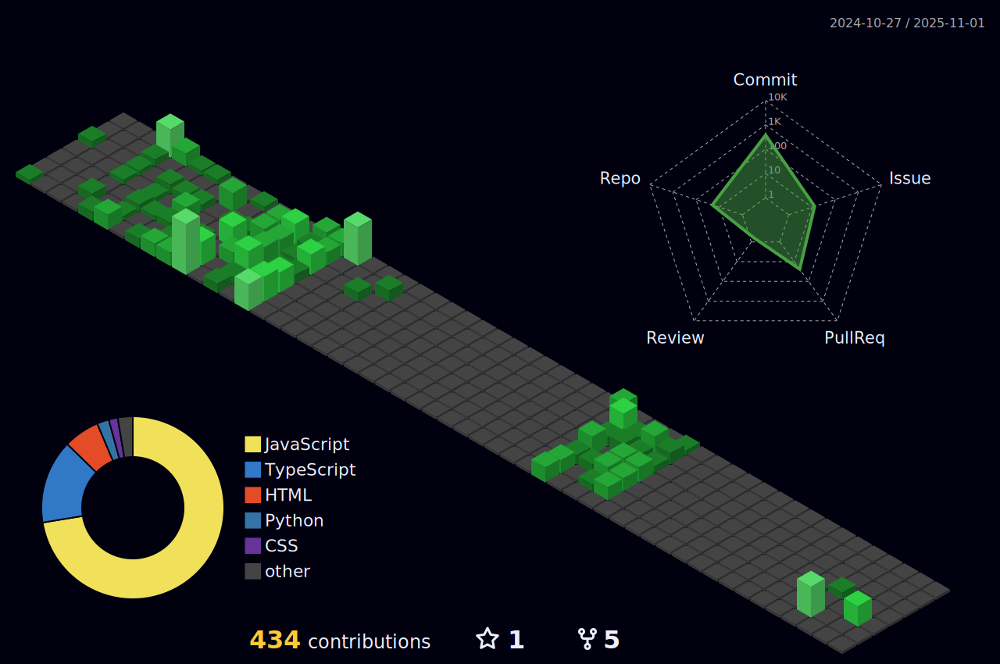

# Vighnesh Brahme [ 🦅ThePhoenix08 ]

I'm a Fourth-Year Computer Engineering student passionate about building things that blend logic, creativity, and data. I love exploring how systems work — from optimizing algorithms to crafting full-stack web apps that actually solve problems.

### What I'm Currently Up To
🔠Sharpening my problem-solving skills on LeetCode (C++, DSA fundamentals — arrays, strings, sliding window, two pointers, binary search, and more) 
🧩 Diving deeper into Backend Development and strengthening my MERN stack knowledge 
🵠Experimenting with Machine Learning, exploring how models can understand emotion in music 
💡 Building projects that merge software engineering with a touch of AI creativity 

### Tech stack

  <a href="https://skillicons.dev">
    
    &nbsp;
    
    &nbsp;
    
  </a>

### Get in touch
<table align="center">
  <tr>
    <td align="center">
      
    </td>
    <td align="center">
      
    </td>
    <td align="center">
      
    </td>
    <td align="center">
      
    </td>
    <td align="center">
      
    </td>
    <td align="center">
      
    </td>
  </tr>
  <tr>
    <td align="center"><b>Gmail</b></td>
    <td align="center"><b>LinkedIn</b></td>
    <td align="center"><b>HackerRank</b></td>
    <td align="center"><b>LeetCode</b></td>
    <td align="center"><b>Portfolio</b></td>
    <td align="center"><b>Resume</b></td>
  </tr>
</table>

### Let's Collaborate!
🚀 Open to collaboration on exciting projects and eager to learn from others in the developer community.

Thanks for stopping by! 😊

---
### GitHub Stats:
<!--  -->
<table align="center">
  <tr>
    <td>
      
    </td>
    <td>
      <a href="https://git.io/streak-stats">
        <!--  -->
        
        <!--  -->
      </a>
    </td>
  </tr>
</table>

---
### My Contributions
<!--  -->
<picture>
  <source media="(prefers-color-scheme: dark)" srcset="https://raw.githubusercontent.com/ThePhoenix08/ThePhoenix08/output/pacman-contribution-graph-dark.svg">
  <source media="(prefers-color-scheme: light)" srcset="https://raw.githubusercontent.com/ThePhoenix08/ThePhoenix08/output/pacman-contribution-graph.svg">
  
<picture/>

<!--Snake
<picture>
  <source media="(prefers-color-scheme: dark)" srcset="https://raw.githubusercontent.com/ThePhoenix08/ThePhoenix08/output/github-contribution-grid-snake-dark.svg" />
  <source media="(prefers-color-scheme: light)" srcset="https://raw.githubusercontent.com/ThePhoenix08/ThePhoenix08/output/github-contribution-grid-snake.svg" />
  
</picture>
-->
---

